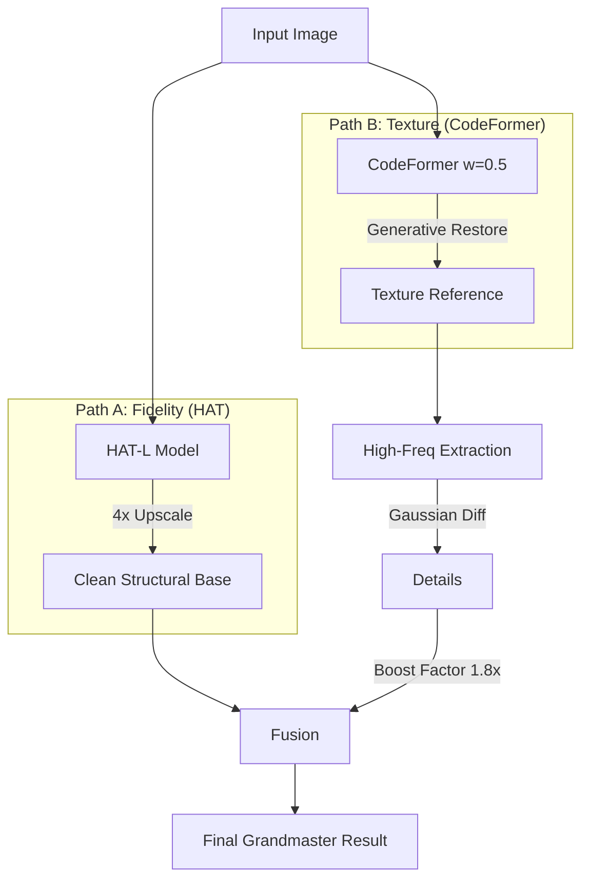

# RWFR Hybrid Fusion: HAT + CodeFormer

**A "Grandmaster" approach to Real-World Face Restoration (RWFR) utilizing a Two-Path Fusion Strategy on the BasicSR framework.**

## 📖 Overview

This repository implements a hybrid restoration pipeline developed for NTIRE challenges. It addresses the trade-off between signal fidelity and perceptual quality by fusing two state-of-the-art models:

1.  **HAT (Hybrid Attention Transformer):** Provides high-fidelity structural restoration (Path A).
2.  **CodeFormer:** Provides generative texture hallucination (Path B).

The final output is generated via a **Frequency-Based Texture Boosting** module that injects high-frequency details from CodeFormer into the structurally accurate HAT base.

## 🏗️ System Design

The pipeline utilizes **BasicSR** as the underlying engine for model inference and data handling.

#
⚡ Grandmaster Fusion Strategy
The final fusion script performs texture injection to combine the best of both models.
It follows these steps:
1. Aligns Path A (HAT) and Path B (CodeFormer) images.
2. Extracts high-frequency details from Path B using Gaussian Blur subtraction:
           I_detail = I(B) - Blur(I(B))
3. Injects details into Path A with a boost factor:
           I_final = I(A) + (I_detail * 1.8)

📊  Evaluation Metrics
--- 🏁 FINAL AVERAGES ---
⭐ PSNR: 43.39 dB (Target > 28 for Fidelity)
⭐ SSIM: 0.9799 (Target > 0.85 for Structure)
⭐ LPIPS: 0.2537 (Target < 0.2 for Perceptual)
